<div align="center">

# 🧠 Zero-Touch – Multimodal Surgeon Assistant


**🏥 Gesture + Gaze + Voice Controlled Surgical Assistant**

[](#)
[](#)
[](#)
[](#)

*Enabling hands-free surgical image navigation through multimodal AI fusion*

</div>

---

## 🎯 Problem Statement

Surgeons need to interact with medical imaging **without breaking sterility or workflow**.

### 🔍 The Challenge

* Surgeons cannot touch screens or keyboards during sterile procedures
* Traditional voice-only systems lack precision for medical imaging
* Existing solutions don't combine gesture, gaze, and voice intelligently
* High latency and cloud dependency compromise real-time surgical workflows
* Lack of context-aware multimodal fusion reduces accuracy

---

## 🚀 Our Solution: Zero-Touch Multimodal Surgeon Assistant

Zero-Touch is a **real-time, multimodal surgical assistant** that fuses **gesture tracking, gaze estimation, and voice commands** to enable hands-free, sterile interaction with medical imaging systems.

It combines **MediaPipe vision models**, **Whisper ASR**, and **lightweight LLMs** with a custom **multimodal fusion engine** to achieve precise, context-aware surgical navigation.

```mermaid
graph TD
    A[👋 Gesture Input] --> D[Multimodal Fusion Engine]
    B[👁️ Gaze Tracking] --> D
    C[🎙️ Voice Commands] --> D
    
    A --> A1[MediaPipe Hands]
    B --> B1[MediaPipe Face Mesh]
    C --> C1[Whisper ASR]
    
    A1 --> A2[Pinch/Swipe/Wave Detection]
    B1 --> B2[Eye Landmark Extraction]
    C1 --> C2[Command Parser LLM]
    
    A2 --> D
    B2 --> D
    C2 --> D
    
    D --> E[Timestamp Alignment]
    E --> F[Intent Classifier]
    F --> G[Action Dispatcher]
    
    G --> H1[Zoom Region]
    G --> H2[Scroll/Pan]
    G --> H3[Highlight Area]
    G --> H4[Load Image]
    
    H1 --> I[Visual Feedback Overlay]
    H2 --> I
    H3 --> I
    H4 --> I
```

<div align="center">



</div>

---

## ⭐ Key Features

### � Real-Time Gesture Tracking

* **MediaPipe Hands** for precise hand landmark detection
* Pinch, swipe, wave, and custom gesture recognition
* Region-of-interest selection via hand pointing
* Adaptive gesture personalization per surgeon

---

### 👁️ Gaze Estimation & Screen Mapping

* **MediaPipe Face Mesh** for eye landmark extraction
* Real-time gaze direction estimation
* Calibrated screen coordinate mapping
* Visual feedback overlay showing gaze focus
* Tested under surgical lighting conditions

---

### 🎙️ Voice Command Intelligence

* **Whisper Tiny** for local, low-latency ASR
* Lightweight LLM (TinyLlama/Phi-2) for flexible command parsing
* Error recovery with clarification prompts
* Memory state tracking (active image, mode, context)
* Medical terminology support

---

### 🧠 Multimodal Fusion Engine

* Timestamp-aligned fusion of gesture + gaze + voice
* Rule-based and transformer-based intent classification
* Context-aware action disambiguation
* Confidence scoring for each modality
* Fallback strategies for low-confidence inputs

---

### ⚡ Low-Latency Real-Time Processing

* **<200ms** end-to-end latency target
* Local-first processing (no cloud dependency)
* Optimized inference pipelines
* Parallel modality processing
* Hardware acceleration support

---

### 🎯 Surgical Workflow Integration

* Sterile, hands-free operation
* Medical image navigation (zoom, pan, scroll)
* Region highlighting and annotation
* Multi-image comparison support
* Customizable action mappings

---

## 🏗️ System Architecture

```
┌─────────────────┐  ┌─────────────────┐  ┌─────────────────┐
│  Gesture Stream │  │   Gaze Stream   │  │   Voice Stream  │
│  MediaPipe Hands│  │ MediaPipe Face  │  │  Whisper ASR    │
└────────┬────────┘  └────────┬────────┘  └────────┬────────┘
         │                    │                    │
         ▼                    ▼                    ▼
┌─────────────────┐  ┌─────────────────┐  ┌─────────────────┐
│ Gesture Parser  │  │  Gaze Calibrator│  │ Command Parser  │
│ (Pinch/Swipe)   │  │ (Screen Coords) │  │  (LLM/Rules)    │
└────────┬────────┘  └────────┬────────┘  └────────┬────────┘
         │                    │                    │
         └────────────────────┼────────────────────┘
                              │
                    ┌─────────▼──────────┐
                    │  Fusion Engine     │
                    │  Timestamp Align   │
                    │  Intent Classifier │
                    └─────────┬──────────┘
                              │
                    ┌─────────▼──────────┐
                    │  Action Dispatcher │
                    │  State Manager     │
                    └─────────┬──────────┘
                              │
         ┌────────────────────┼────────────────────┐
         ▼                    ▼                    ▼
┌─────────────────┐  ┌─────────────────┐  ┌─────────────────┐
│  Image Control  │  │ Visual Feedback │  │ Audio Feedback  │
│  (Zoom/Pan)     │  │   Overlay       │  │   (TTS)         │
└─────────────────┘  └─────────────────┘  └─────────────────┘
```

---

## 🛠️ Technology Stack

<div align="center">

### Core


### Vision & Gesture


### Voice & Language


### Fusion & Integration


</div>

---

## 🔐 Ethics & Safety

* Privacy-first architecture
* User-controlled data
* Non-prescriptive AI responses
* Transparent AI decisions
* Accessibility-focused design

---

## 🚀 Getting Started

### Prerequisites

```bash
Python 3.8+
pip
Ollama (optional, for local AI)
Webcam/Camera device
```

### Installation

```bash
git clone https://github.com/YeswanthRam28/Zero-Touch.git
cd Zero-Touch
pip install -r requirements.txt
python main_audio.py
```

---

## 📸 Project Components

## 🎯 Use Cases

* **Sterile Surgical Procedures**: Navigate medical imaging without breaking sterility
* **Operating Room Workflows**: Hands-free control during active surgery
* **Medical Image Review**: Zoom, pan, and annotate diagnostic images
* **Radiology Consultations**: Multi-image comparison and analysis
* **Training & Simulation**: Surgical education with multimodal interaction
* **Emergency Medicine**: Rapid image access in time-critical situations

---

## 🏆 Innovation Highlights

* **Multimodal Fusion**: First-of-its-kind gesture + gaze + voice integration for surgery
* **Real-Time Performance**: <200ms latency for surgical-grade responsiveness
* **Local-First Processing**: No cloud dependency for privacy and reliability
* **Adaptive Personalization**: Learns individual surgeon gesture patterns
* **Surgical Workflow Optimized**: Designed specifically for sterile OR environments
* **Lightweight AI**: Runs on standard hardware without GPU requirements

---


<table align="center">
<tr>
<td align="center"></td>
<td align="center"></td>
<td align="center"></td>
<td align="center"></td>
</tr>
</table>

---

## 👨‍💻 Project Collaborators

<table align="center">
<tr>
<th>Role</th>
<th>Team Member</th>
<th>GitHub</th>
</tr>
<tr>
<td><b>🎯 Vision & Gaze Lead</b><br/><i>Gesture Tracking, Eye Tracking, Visual Feedback</i></td>
<td><b>Raghavan</b></td>
<td><a href="https://github.com/Raghavan7777"></a></td>
</tr>
<tr>
<td><b>🎙️ Audio & Intent Lead</b><br/><i>Voice Recognition, Command Parsing, AI Integration</i></td>
<td><b>Yeswanth Ram</b></td>
<td><a href="https://github.com/Yeswanthram28"></a></td>
</tr>
<tr>
<td><b>🧠 Fusion & Integration Lead</b><br/><i>Multimodal Fusion, System Integration, Testing</i></td>
<td><b>VetriSelvan</b></td>
<td><a href="https://github.com/njr-vetri"></a></td>
</tr>
</table>

---

<div align="center">


</div>

---

> *"Surgical technology should be intelligent, hands-free, and seamlessly integrated into the workflow."*

---
